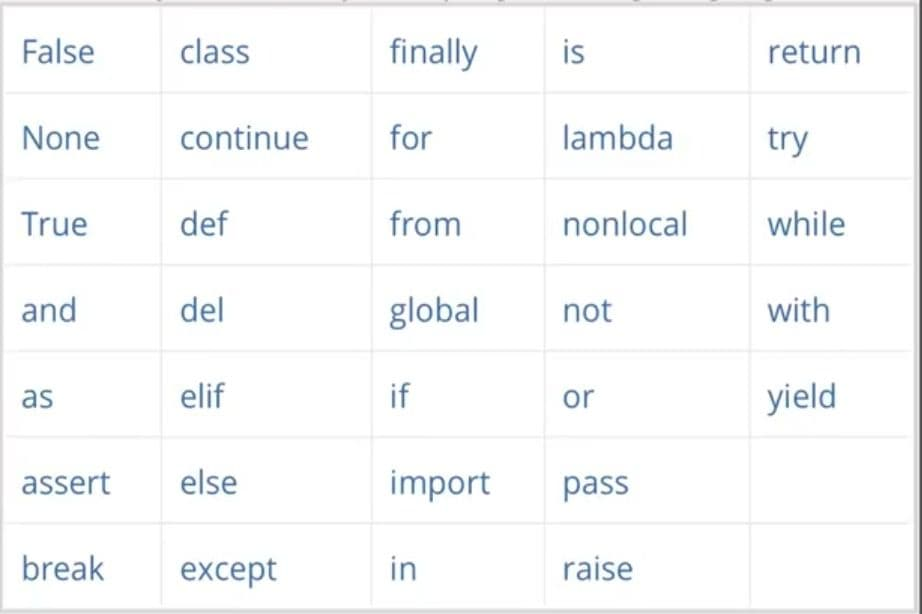

# **Python-ning boshlang'ich bilimlari** 

# __O'zgaruvchilar__
> *Python* dasturlash tilida jumladan boshqa dasturlash tillarida ham o'zgaruvchilar katta ahamiyatga ega hisoblanadi! Python dasturlash tilida boshqa dasturlash tillaridan farqli ularoq tip e'lon qilmaydi!!

> ‼️O'zgaruvchi‼️ - Xotiraning nomlangan qismi bo’lib, o’zida ma’lum bir toifadagi qiymatlarni saqlaydi. O’zgaruvchining nomi va qiymatlari bo’ladi. O’zgaruvchining nomi orqali qiymat saqlanayotgan xotira qismiga murojaat qilinadi. Programma ishlashi jarayonida o’zgaruvchining qiymatini o’zgartirish mumkin. Har qanday o’zgaruvchini ishlatishdan oldin, uni e’lon qilish lozim.

> *Python* dasturlash tilida o'zgaruvchini tipi e'lon qilinmaydi! Dastur kodini yozish jarayonida tipni o'zingiz hohlagan turga o'tkazishingiz mumkin. Buni esa keyingi darslarda ko'rib chiqamiz! Hozir siz bilan dasturlash tilini o'rganish jarayonida qiyinchilikka o'chramasligingiz uchun oddiysidan boshlaymiz!

# __Eslatma__
> O'zgaruvchilar nom qo'yish!

- O'zgaruvchi qisqa nomga ega bo'lishi mumkin (masalan, x va y) yoki ko'proq tavsiflovchi nom (yosh, karnay, master va h.k). 
- Python o'zgaruvchilar uchun qoidalar:
	- O'zgaruvchilar [a-Z] harf bilan yoki "_"pastga belgi bilan boshlanishi zarur!
	- O'zgaruvchilar nomi raqam bilan boshlanmaydi!
	- O'zgaruvchi [a-Z] harf bilan yoki "_"pastga belgi bilan boshlanib raqamlar ham aralashtirsa bo'ladi. ( _ali123, son90 va h.k)
	- O'zgarvchi nomida katta va kichik harflar ahamiyatga ega bo'lib misol uchun Aka va aka ikki xil o'zgaruvchi nomi hisoblanadi! (Aka, aka, AkA, aKa)

**Yaroqli Python o'zgaruvchilar nomlari**
  - O'zgaruvchilarni to'g'ri nomlash

> O'zgaruvchi nomida ba'zi belgilarga ruxsat berilmaydi; biz rioya qilishimiz kerak bo'lgan bir nechta qoidalar mavjud. O'zgaruvchi nomida paydo bo'lishi mumkin bo'lgan haqiqiy belgilarning to'liq ro'yxatidan boshlaylik:

- Kichik va katta harflar: az va AZ

- Raqamlar: 0-9

- Pastki chiziq: _

> Bundan tashqari, ikkita qoida mavjud :

- O'zgaruvchilar nomlari **harf** yoki **pastki chiziq belgisi** bilan boshlanishi kerak va **raqam bilan boshlanmasligi kerak**.

- Ismlar katta-kichik harflarga sezgir

> Mana ba'zi to'g'ri o'zgaruvchilar nomlari :

- ism_1

- ism_2

- yosh_1

- _bazaga_ulanish_uchun

**Bu noto'g'ri nomlar**

- 1ism (__raqam bilan boshlamang__)

- mening-raqamim (__- ruxsat berilmaydi__)

- mening raqamim (__bo'sh joylarga ruxsat berilmaydi__)

> Va bu o'zgaruvchilar bir xil emas, katta-kichik harf sezgirligi tufayli:

- text = 'python'

- TEXT = 'salom python'

- TeXt = 'python salom'

# __Zaxira kalit so'zlarini o'zgaruvchan nom sifatida ishlatmang, masalan rasmga qarang 👇.__

